Voice Assistant :information_desk_person::sound:
===
*Project created as a part of the subject 'Programming in Python' in AGH University of Science and Technology.*

## Team :punch:

+ [Jakub Myśliwiec](https://github.com/jmysliv):airplane::bomb:
+ [Sebastian Kuśnierz](https://github.com/skusnierz) :fire:

## About Project :question:

Our idea was to create voice assistant similar to Google assistant but for desktop devices and in polish language. We decided that assistant will have the following features:

+ [telling jokes](#joke) :joy:
+ [finding curiosities](#curiosities) :mortar_board:
+ [playing YouTube videos](#yt) :tv:
+ [searching phrase in both Wikipedia and Google](#wiki) :mag_right:
+ [checking current COVID-19 data](#covid) :skull:
+ [planning events](#events) :date:
+ [sending and receiving messages with other users](#message) :incoming_envelope:
+ [planning tasks](#tasks) :calendar:
+ [changing volume](#volume) :mute:
+ [checking current weather](#weather) :cloud:
+ [changing brightness of the screen](#brightness) :high_brightness:

During implementation we used many libraries and frameworks, for instance:

+ Django REST Framework to implement dedicated server
+ Selenium for automating web browsers
+ Google speech recognition
+ Tkinter for creating graphical user interface

While working on the project we learned how to properly configure python virtual environment, so we could use it easily with operating systems both Ubuntu and Windows. New experience for us was to create REST API server using Django framework. We've had experience with REST API architecture before, but in different programming languages, so it was our first time with Django. We have also learned a lot about group cooperation, and sharing responsibilities.

## Get Started :rocket:

First thing you have to do is to clone this repository, type the following commands in your terminal:
```bash
    git clone git@github.com:jmysliv/VoiceAssistant.git
    cd VoiceAssistant
```


### Install requirements :mega:
All necessary libraries and packages are in file [requirements_windows.txt](VoiceAssistant/requirements_windows.txt) for windows operating system and in  [requirements_linux.txt](VoiceAssistant/requirements_linux.txt) for Linux.  
Before running command below make sure that you have installed Python 3.7+. :snake: 

##### Windows :poop:
```bash
    cd VoiceAssistant
    python -m venv venv
    source venv/Scripts/activate
    pip install -r requirements_windows.txt
    pipwin install pyaudio
```
Sometimes when you try to install pyaudio using pipwin, some errors may occur. If that happens you have to install pyaudio using .whl file which you can download it from:
https://www.lfd.uci.edu/~gohlke/pythonlibs/#pyaudio

Find the appropriate .whl file that matches your Python version (you can check your python version using ```python --version```) and put it in the directory where VoiceAssistant is located. Then you can install pyaudio using pip:
```bash
    pip install <name of your .whl file>.whl
```

##### Linux :ok_hand:
```bash
    cd VoiceAssistant
    bash install_requirements_ubuntu.sh
```

### Install Chrome webdriver 
  
You can find and download the Chrome webdriver from:
https://chromedriver.chromium.org/downloads. Make sure it's appropriate for your Chrome Browser version. If you don't know your Chrome Browser version this [link](https://help.zenplanner.com/hc/en-us/articles/204253654-How-to-Find-Your-Internet-Browser-Version-Number-Google-Chrome) might be helpful.    
Once you donloaded your driver, unzip it to [driver folder](VoiceAssistant/drivers) and make sure that filename is "chromedriver" ("chromedriver.exe" if you are using Windows).

### Run assistant
##### Linux
```bash
    cd UI
    ../venv/bin/python3 main.py
```
##### Windows
```bash
    cd UI
    ../venv/Scripts/python main.py
```


## Adding new features
*If you enjoy idea of our project and you want to develop it, here is simple guide how to add new feature to our assistant.*

You have to create new Python file in [services module](VoiceAssistant/services). Besides of implementation of your service, you should place inside your file two functions:

1. ```get_wake_words()``` it should return the array of phrases that you want the assistant to recognize, that will trigger execution of what you want your service to do. Note that all phrases should be lowercase. Also make sure, that your wake words are unique and any of them isn't used by different service. For example if you writing service for food ordering, your function could look like that:
```python
    def get_wake_words():
        return ["zamów jedzenie", "chce coś zjeść"]
```

2. ```wake_function(frame, text, token)``` is the function that will execute after assistant recognize one of your ```wake_words```. It takes three arguments:

    * ```frame``` that is responsible for what you see on the screen and what the assistant says. You can use the following functions:

        * ```frame.assistant_speaks(message)``` as message you pass what you want the assistant to say.
        * ```frame.user_speaks(message)``` as message you pass what you want to be displayed as what you said.
        * ```frame.assistant_listening()``` if you want the assistant to mark that he listening. He will say "Słucham...". 
        * ```frame.assistant_doesnt_understand()``` if you want the assistant to mark that he doesn't understand what user said. He will say "Nie rozumiem, możesz powtórzyć?". 

    * ```text``` it stores the phrase that user said.

    * ```token``` it stores token for server access.

    For example if you writing service for food ordering your wake function could look like that:
    ```python
        def wake_function(frame, text, token):
            frame.assistant_speaks("Co chcesz zjeść?")
            food = get_audio(5)
            while food == "":
                frame.assistant_doesnt_understand()
                food = get_audio(5)
            frame.user_speaks(food)
            order_food(food) #function that orders food
            frame.assistant_speaks("Zamówione")
    ```

*Note that if you need to recognize some additional speech in your service you need to import ```get_audio```, that takes one argument which is timeout in seconds*
```python
    from speech.speech_recognizer import get_audio
```

If you finished adding your service don't hesitate to make a pull request. Also if you notice something we missed, or discover some bug, feel free to open new issue, or simply fix it and make pull request.

## User Guide :heavy_exclamation_mark:

*Here you can find information how to proper interact with our assistant, and what command is responsible for what feature.*  
*At the beginning you have to wake your assistant, you can do it by saying **"Janusz"**,* 
*this word mobilizes the assistant to act, and the assistant is waiting for your command to execute from now on.*
### Telling jokes <a id="joke"></a> :joy:
You can ask assistant to tell a joke, but in your command you should put one of the following words (You can change inflection tip as you like):
```
"suchar", "żart", "dowcip"
```
For example, you could say something like this:

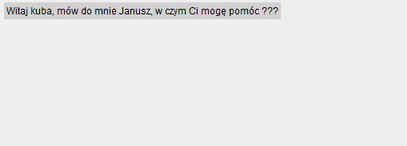
### Finding curiosities <a id="curiosities"></a> :mortar_board:
You can ask assistant to find some curiosities, but in your command you should put one of the following words (You can change inflection tip as you like):
```
"ciekawostki", "ciekawego", "ciekawostka"
```
For instance, you could say something like this:

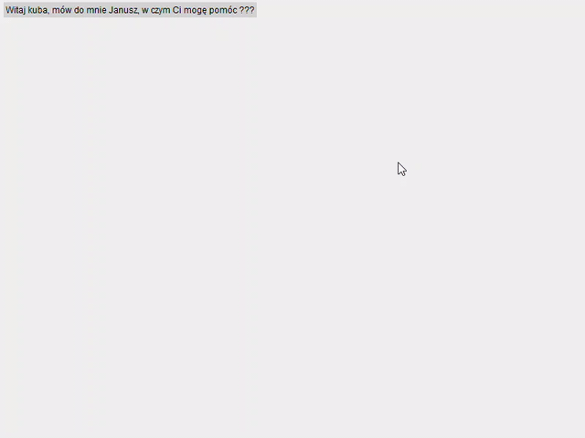
### Playing YouTube videos <a id="yt"></a>  :tv:
Assistant can help you play YouTube videos as well. All you have to do is to use one of the following word, and then say name of the video
```
"uruchom", "włącz", "puść"
```

For example, your command could look like this:


### Checking current COVID-19 data <a id="covid"></a> :skull:
Our assistant helps you being up to date with coronavirus news. To get latest news put in your command one of the following words (You can change inflection tip as you like):
```
"koronawirus", "korona wirus"
```
For instance, you could say something like this:

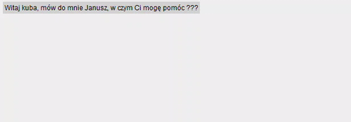
### Planning events  <a id="events"></a> :date:
You can also tell assistant information about events, which you want him to remember. You can add new event by saying:
```
"dodaj wydarzenie", "dodaj nowe wydarzenie", "zaplanuj wydarzenie"
```
If you want to check, what events you have planned, simply say:
```
"pokaż wydarzenia", "wyświetl wydarzenia", "jakie mam wydarzenia", "co mam zaplanowane", "co mam w planach"
```

Here is example, how interaction with our assistant could look like:

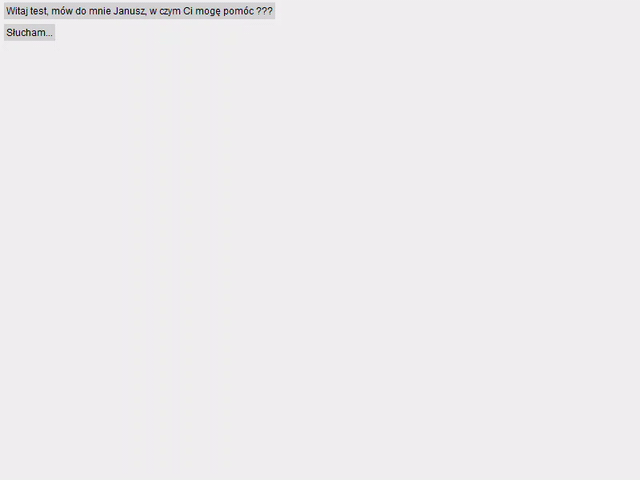

### Sending and receiving messages with other users  <a id="message"></a> :incoming_envelope:
Our assistant allows his users to communicate with each other. If you want to send message to other user, you have to say:
```
"wyślij wiadomość", "napisz wiadomość"
```
After you send message, you probably want to check if the receiver read your message. All you have to do is to use one of the following command:
```
"pokaż wiadomości", "pokaż wiadomości które wysłałem"
```
To check if somebody sent you a message, you should say:
```
"pokaż skrzynkę odbiorczą", "pokaż nowe wiadomości"
```
If you want to let sender know that you read the content, tell assistant one of the following phrase:
```
"oznacz wiadomość jako przeczytaną", "przeczytałem wiadomość"
```
To see old messages, use the following command:
```
"pokaż stare wiadomości"
```

Here is example, how such interaction with our assistant could look like:

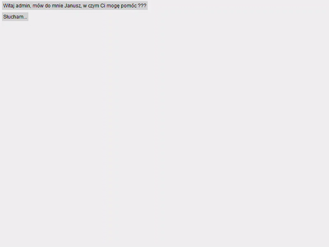

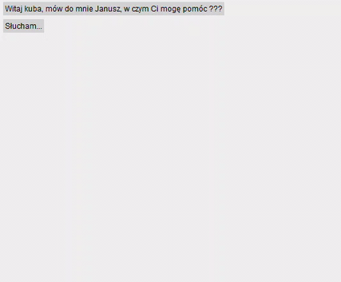

### Planning tasks  <a id="tasks"></a> :calendar:
Assistant makes sure that the user doesn't forget anything and let him stores information about tasks. User can add new task by saying:

```
"dodaj zadanie", "zaplanuj zadanie", "dodaj rzecz do zrobienia"
```
To see list of things to do, you need to say:
```
"zadania do wykonania", "niezrobione zadania", "co mam zrobić", "co jest do zrobienia"
```
You can also let assistant knows that you finished some task. For that use one of the following commands:
```
"oznacz zadanie jako zrobione", "zrobiłem zadanie", "wykonałem zadanie"
```
If you want to see a list of completed tasks, simply say:
```
"co zrobiłem", "przeszłe zadania"
```

Here you can find an example:

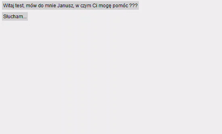

### Changing volume  <a id="volume"></a> :mute:
To change volume at your computer use one of the following commands:
```
 "głośność", "przycisz", "podgłośni", "dźwięk"
```

For example, you could say something like this:

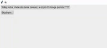

### Checking current weather  <a id="weather"></a> :cloud:
If you want to check the current weather, you can ask your assistant. Remember to include the name of the city or country in which you want to check the weather, as well as one of the following words in the command:
```
"pogoda"
```
For example, your command could look like this:

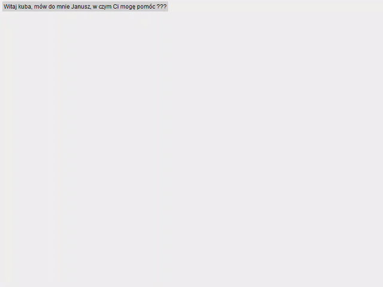

### Changing brightness of the screen <a id="brightness"></a> :high_brightness:
To change brightness of your computer screen, use one of the following command:
```
 "jasność", "kontrast"
```

Here is an example of use:

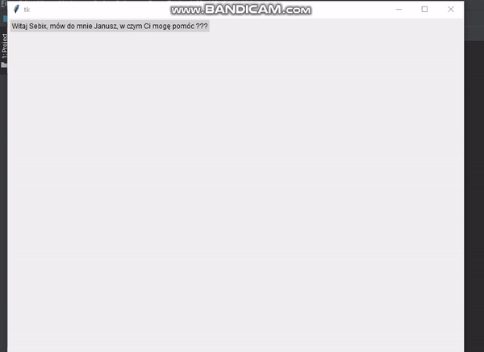

### Searching phrase in both Wikipedia and Google <a id="wiki"></a> :mag_right:

If the given command doesn't match any of the above wake words, the given phrase will be searched in Wikipedia and the search results will be read by assistant,
if it still gives unsuccessful result the command will be searched in Google and results will be displayed in the browser.

That feature allows user to search information about something. Here is an example of getting information from Wikipedia:

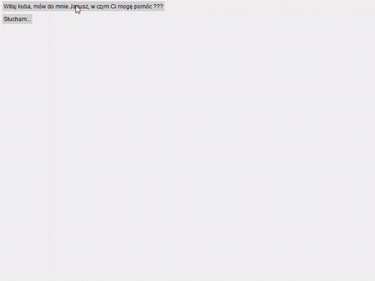

Here is an example of getting information from Google:

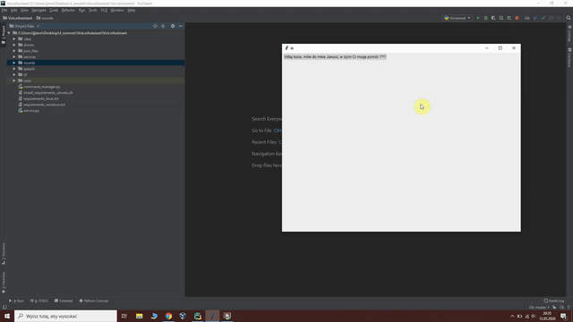